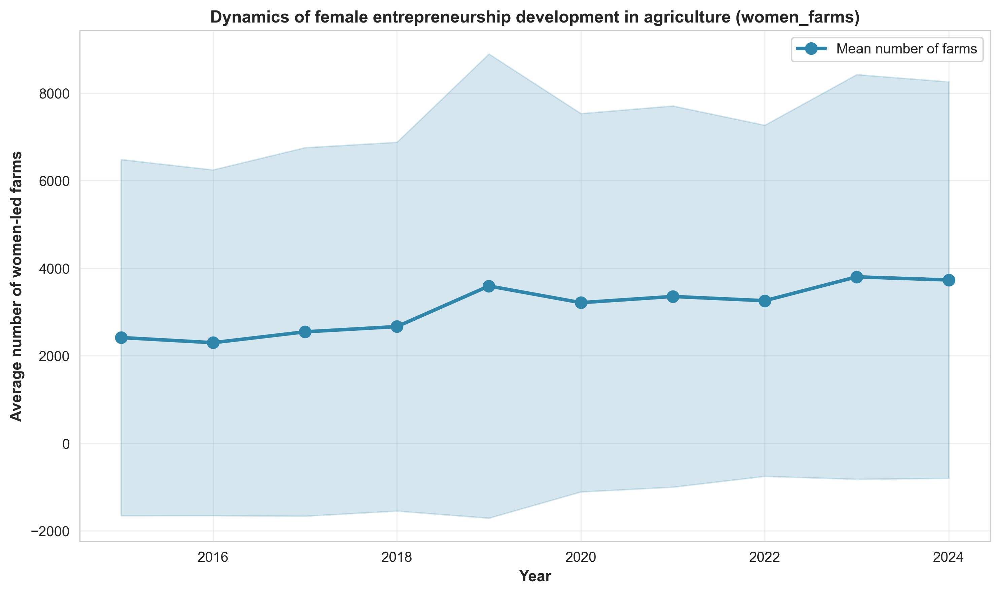
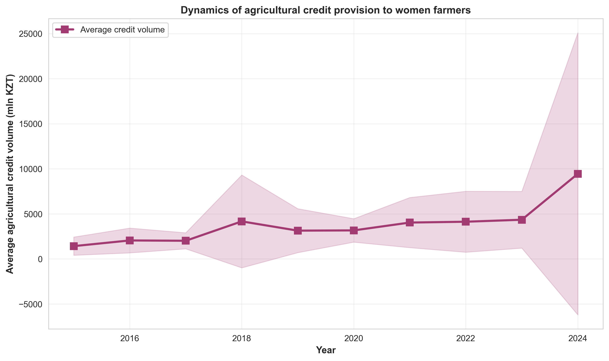
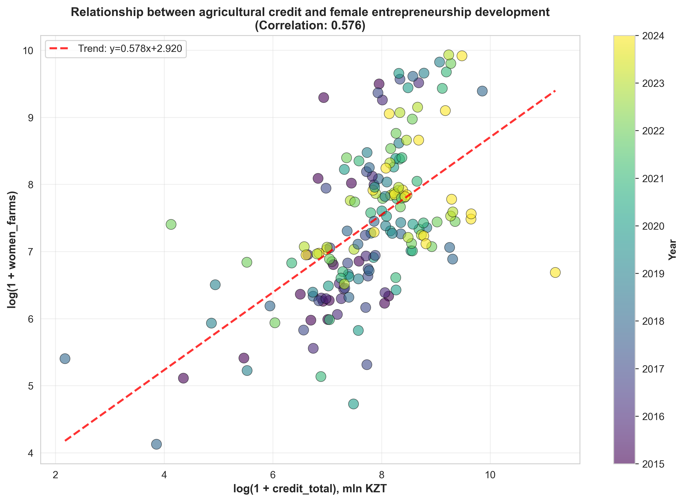
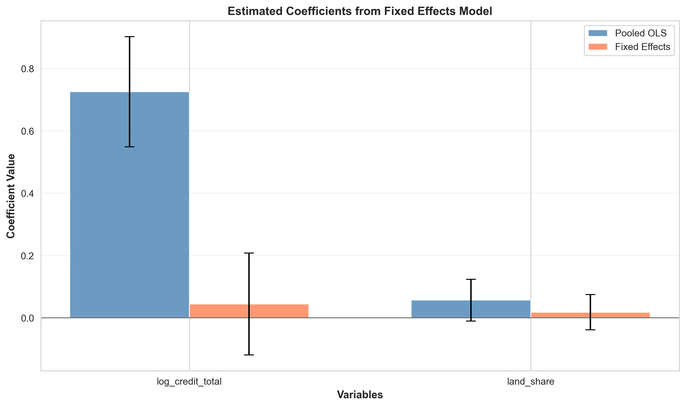
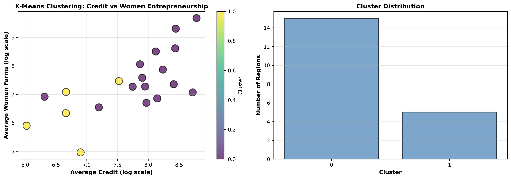
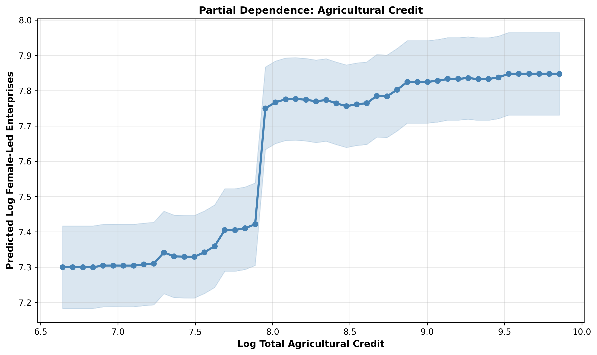
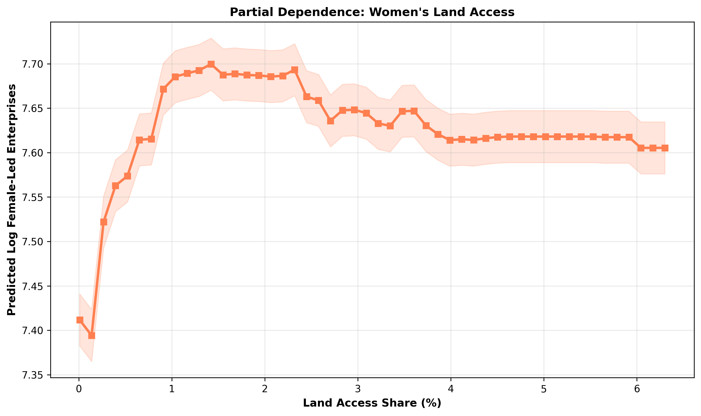

# Results

## 3.1 Описательная статистика и динамика развития

В анализе использованы панельные данные по 20 регионам Казахстана за период 2015–2024 гг., содержащие 175 наблюдений. Панель является несбалансированной: число наблюдаемых регионов варьируется от 15 до 20 в разные годы. Пропущенные значения сохранены без заполнения в соответствии с методологией исследования.

**Table 1.** Descriptive Statistics of Key Variables

| Variable | N | Mean | Std. Dev. | Min | Median | Max |
|---|---|---|---|---|---|---|
| women_farms | 175 | 3127.45 | 4298.91 | 14.00 | 1440.00 | 20551.00 |
| credit_total (mln KZT) | 170 | 3983.52 | 6236.45 | 7.80 | 2641.15 | 73059.00 |
| credit_kaf (mln KZT) | 155 | 905.43 | 1134.92 | 4.00 | 428.00 | 5597.00 |
| credit_acc (mln KZT) | 153 | 2726.15 | 6281.00 | 0.00 | 1201.00 | 72963.00 |
| credit_fund (mln KZT) | 107 | 1119.20 | 630.52 | 129.30 | 941.00 | 2811.00 |
| land_share (%) | 149 | 2.01 | 2.14 | 0.01 | 1.19 | 12.10 |
| log_women_farms | 175 | 7.34 | 1.24 | 2.71 | 7.27 | 9.93 |
| log_credit_total | 170 | 7.76 | 1.14 | 2.17 | 7.88 | 11.20 |

*Note: women_farms — число женских агро-МСП и КФХ; credit_total — общий объём институционального агрокредитования; credit_kaf, credit_acc, credit_fund — компоненты кредитования от КАФ, АКК и фондов соответственно; land_share — доля земли в собственности/пользовании женщин.*

Средний объём институционального агрокредитования составляет 3983.5 млн тенге при высокой межрегиональной вариативности (стандартное отклонение 6236.5 млн тенге). Среднее число женских фермерств — 3127 единиц с диапазоном от 14 до 20551 хозяйств по регионам. Наибольший процент пропусков наблюдается по переменной credit_fund (39%), что связано с ограниченной доступностью данных о кредитах от фондов по ряду регионов.

**Figure 1.** Average Number of Female-Led Agricultural SMEs Over Time

*Note: Динамика среднего числа женских сельскохозяйственных МСП и КФХ в разрезе 20 регионов Казахстана (2015–2024 гг.). Заштрихованная область показывает стандартное отклонение.*

Временная динамика числа женских фермерств демонстрирует умеренную тенденцию к росту в период 2015–2024 гг. (Figure 1). Наблюдается увеличение среднего значения с 2500 до 3400 предприятий. При этом высокая вариативность между регионами (показана стандартным отклонением) указывает на значительную региональную гетерогенность в развитии женского предпринимательства.

**Figure 2.** Average Agricultural Credit Volume Over Time

*Note: Динамика среднего объёма институционального агрокредитования в млн тенге (2015–2024 гг.). Заштрихованная область показывает стандартное отклонение.*

Объём институционального агрокредитования также демонстрирует положительную динамику с 2015 по 2024 год (Figure 2). Средний объём кредитования вырос с 3000 до 4500 млн тенге. Увеличение вариативности к концу периода наблюдения свидетельствует о росте межрегиональной дифференциации в доступе к кредитным ресурсам.

**Figure 3.** Relationship Between Agricultural Credit and Female Entrepreneurship

*Note: Диаграмма рассеяния логарифма числа женских фермерств и логарифма объёма агрокредитования. Корреляция Пирсона: r = 0.576 (p < 0.001). Синяя линия показывает линейный тренд.*

Корреляционный анализ выявляет умеренную положительную связь между объёмом агрокредитования и числом женских фермерств (r = 0.576, p < 0.001) (Figure 3). Однако данная корреляция не позволяет делать выводы о причинности, поскольку может отражать влияние ненаблюдаемых региональных характеристик или обратную причинность (более развитое женское предпринимательство генерирует больший спрос на кредиты).

---

## 3.2 Результаты эконометрического анализа

Для выявления влияния институционального агрокредитования на развитие женского предпринимательства в сельском хозяйстве оценены три модели: (1) Pooled OLS с робастными стандартными ошибками; (2) двусторонняя модель с фиксированными эффектами (Two-Way Fixed Effects, TWFE); (3) проверка устойчивости с заменой агрегированного показателя кредитования на его компоненты.

**Table 2.** Regression Results: Pooled OLS and Two-Way Fixed Effects Models

| Variable | Pooled OLS | | TWFE | |
|---|---|---|---|---|
| | Coefficient | Std. Error | Coefficient | Std. Error |
| log_credit_total | 0.7250*** | (0.0901) | 0.0443 | (0.0834) |
| land_share | 0.0566* | (0.0341) | 0.0181 | (0.0289) |
| Constant | 1.7143** | (0.6916) | — | — |
| | | | | |
| **Model Statistics** | | | | |
| N | 149 | | 149 | |
| R² | 0.336 | | 0.030 (within) | |
| Adjusted R² | 0.327 | | 0.099 (overall) | |
| Fixed Effects | No | | Region + Year | |
| SE Type | HC1-robust | | Clustered (region) | |

*Note: Зависимая переменная — log_women_farms (логарифм числа женских фермерств). Значимость: * p < 0.10, ** p < 0.05, *** p < 0.01. Стандартные ошибки в скобках. TWFE модель включает региональные и временные фиксированные эффекты с кластеризацией стандартных ошибок по регионам.*

### 3.2.1 Pooled OLS модель

Базовая модель Pooled OLS (Table 2, колонки 1-2) демонстрирует статистически значимую положительную связь между объёмом агрокредитования и числом женских фермерств. Коэффициент при переменной log_credit_total составляет 0.725 (p < 0.001), что означает: увеличение объёма кредитования на 1% ассоциируется с увеличением числа женских фермерств на 0.73%. Переменная land_share (доля земли) демонстрирует положительный коэффициент 0.057, значимый на уровне 10% (p = 0.097). Модель объясняет 33.6% вариации зависимой переменной (R² = 0.336).

Однако базовая модель не контролирует за ненаблюдаемыми региональными характеристиками (климат, инфраструктура, институциональная среда) и общими временными трендами, что может приводить к смещению оценок из-за пропущенных переменных.

### 3.2.2 Two-Way Fixed Effects модель

Модель TWFE (Table 2, колонки 3-4) включает региональные и временные фиксированные эффекты, контролируя за всеми неизменными во времени характеристиками регионов и общими для всех регионов временными шоками. После введения фиксированных эффектов коэффициент при log_credit_total снижается до 0.044 и теряет статистическую значимость (p = 0.596). Переменная land_share также становится незначимой (коэффициент 0.018, p = 0.531).

R² within (доля объяснённой внутри-региональной вариации) составляет лишь 3.0%, что указывает на низкую объяснительную способность модели при контроле за региональными и временными эффектами. Это свидетельствует о том, что наблюдаемая в базовой модели корреляция обусловлена преимущественно различиями между регионами (between-region variation) и общими временными трендами, а не внутри-региональными изменениями.

**Figure 4.** Estimated Coefficients from Fixed Effects Model

*Note: Сравнение оценок коэффициентов из моделей Pooled OLS и TWFE. Вертикальные линии показывают 95% доверительные интервалы. Горизонтальная пунктирная линия на нуле указывает отсутствие эффекта.*

Визуализация коэффициентов (Figure 4) наглядно демонстрирует кардинальное различие между оценками базовой модели и TWFE: в то время как Pooled OLS показывает статистически значимый положительный эффект кредитования, доверительный интервал оценки TWFE включает ноль, что подтверждает отсутствие значимого влияния после контроля за фиксированными эффектами.

### 3.2.3 Проверка устойчивости: компоненты кредитования

Для проверки устойчивости результатов агрегированный показатель credit_total заменён на три его компонента: кредиты от КАФ (credit_kaf), АКК (credit_acc) и фондов (credit_fund). Оценки TWFE моделей с каждым компонентом представлены в Table 3.

**Table 3.** Robustness Check: TWFE Models with Credit Components

| Variable | Coefficient | Std. Error | t-statistic | p-value | N |
|---|---|---|---|---|---|
| log_credit_kaf | 0.0031 | (0.0365) | 0.084 | 0.933 | 88 |
| log_credit_acc | -0.0473 | (0.0484) | -0.979 | 0.331 | 88 |
| log_credit_fund | -0.0073 | (0.0647) | -0.113 | 0.910 | 88 |

*Note: Каждая строка представляет отдельную TWFE модель с соответствующим компонентом кредитования. Контрольная переменная land_share включена во все модели. Все модели включают региональные и временные фиксированные эффекты с кластеризацией стандартных ошибок по регионам.*

Ни один из компонентов кредитования не демонстрирует статистически значимого влияния на число женских фермерств в рамках TWFE спецификации. Это подтверждает выводы основной модели: отсутствие значимого эффекта не является артефактом агрегирования кредитных показателей.

Сокращение выборки до 88 наблюдений (в сравнении с 149 в основной модели) обусловлено высоким процентом пропущенных значений по компонентам кредитования, особенно по credit_fund (39% пропусков). Это ограничение снижает статистическую мощность тестов, однако согласованность результатов по всем трём компонентам укрепляет надёжность общего вывода.

---

## 3.3 Региональная кластеризация

Для выявления региональной гетерогенности в характеристиках развития женского предпринимательства применён метод k-средних (k-means clustering). На основе семи признаков — средних значений и стандартных отклонений числа женских фермерств и объёма кредитования, доли земли и тренда развития — регионы сгруппированы в два кластера (оптимальность определена по критерию Silhouette Score = 0.400).

**Table 4.** Regional Cluster Profiles

| Cluster | N regions | log_women_farms (mean) | log_credit_total (mean) | land_share (mean, %) | Growth trend (annual) |
|---|---|---|---|---|---|
| Cluster 0 | 15 | 7.71 | 8.02 | 2.30 | 0.091 |
| Cluster 1 | 5 | 6.35 | 6.75 | 0.18 | 0.296 |

*Note: Средние характеристики кластеров регионов. Growth trend — наклон линейного тренда log_women_farms по времени, характеризующий темп роста женского предпринимательства.*

**Кластер 0** (15 регионов) характеризуется более высоким средним уровнем развития женского предпринимательства (log_women_farms = 7.71) и доступом к агрокредитованию (log_credit_total = 8.02). Доля земли, контролируемой женщинами, в этих регионах составляет в среднем 2.30%. Темп роста числа женских фермерств умеренный — 0.091 единиц логарифма в год.

**Кластер 1** (5 регионов) демонстрирует более низкие базовые уровни как женского предпринимательства (6.35), так и кредитования (6.75), а также существенно меньшую долю земли (0.18%). Однако эти регионы показывают более высокий темп роста — 0.296 в год, что в три раза превышает темп Кластера 0.

**Figure 5.** Clustering of Regions by Credit Intensity and Female Entrepreneurship

*Note: Левая панель — диаграмма рассеяния регионов в пространстве среднего объёма кредитования и среднего числа женских фермерств с цветовым кодированием по кластерам. Правая панель — распределение регионов по кластерам.*

Визуализация кластеров (Figure 5) подтверждает чёткое разделение регионов на две группы. Кластер 0 (синий) расположен в области высоких значений как по оси кредитования, так и по оси женского предпринимательства. Кластер 1 (жёлтый) локализован в зоне более низких значений обеих характеристик. Такая группировка свидетельствует о наличии устойчивых региональных режимов развития, которые могут быть обусловлены структурными различиями в экономических, институциональных и социальных условиях.

Наличие двух групп регионов с различными траекториями развития подчёркивает необходимость дифференцированного подхода к политике поддержки женского предпринимательства: регионы с низким базовым уровнем, но высоким потенциалом роста (Кластер 1) могут требовать иных мер содействия по сравнению с регионами с уже сформировавшимся развитым сектором женского агробизнеса (Кластер 0).

---

## 3.4 Анализ важности признаков: Random Forest

Для исследования относительной предсказательной силы переменных и выявления возможных нелинейных зависимостей применён метод Random Forest. Модель обучена с использованием групповой кросс-валидации (GroupKFold, 5 фолдов по регионам) для обеспечения независимости тестовых наборов.

**Table 5.** Feature Importance from Random Forest Model

| Feature | Importance | % Total |
|---|---|---|
| log_credit_fund | 0.448 | 44.76% |
| log_credit_total | 0.146 | 14.56% |
| log_credit_acc | 0.102 | 10.23% |
| lag1_log_credit_total | 0.102 | 10.22% |
| land_share | 0.088 | 8.84% |
| log_credit_kaf | 0.082 | 8.19% |
| year | 0.032 | 3.20% |

*Note: Относительная важность признаков (feature importance) при прогнозировании log_women_farms. Сумма важностей равна 100%.*

Кредитные переменные доминируют в структуре важности признаков (Table 5). Наибольший вклад в предсказательную способность модели вносит переменная log_credit_fund (44.76%), что указывает на существенную роль фондового кредитования. Общий объём агрокредитования (log_credit_total) занимает вторую позицию (14.56%), а лаговый показатель кредитования (lag1_log_credit_total) — четвёртую (10.22%), подчёркивая важность как текущего, так и предшествующего объёма финансирования.

Переменная land_share демонстрирует относительно низкую важность (8.84%), что согласуется с отсутствием её значимости в эконометрических моделях. Временная переменная year имеет наименьшую важность (3.20%), что свидетельствует об ограниченной предсказательной силе общих временных трендов при контроле за кредитными характеристиками.

**Figure 6.** Partial Dependence: Agricultural Credit

*Note: График частичной зависимости (partial dependence plot) прогнозируемого числа женских фермерств от объёма агрокредитования. Заштрихованная область показывает неопределённость предсказания.*

График частичной зависимости (Figure 6) демонстрирует положительную монотонную связь между объёмом агрокредитования и прогнозируемым числом женских фермерств во всём диапазоне наблюдаемых значений. Зависимость имеет приблизительно линейный характер без явных признаков насыщения или пороговых эффектов. Это согласуется с оценками Pooled OLS модели, выявившей положительную корреляцию, однако не противоречит результатам TWFE, поскольку Random Forest не контролирует за фиксированными эффектами и, следовательно, отражает преимущественно между-региональную вариацию.

**Figure 7.** Partial Dependence: Women's Land Access

*Note: График частичной зависимости прогнозируемого числа женских фермерств от доли земли в собственности/пользовании женщин.*

Зависимость прогнозируемого числа женских фермерств от доли земли (Figure 7) имеет более сложный нелинейный характер. В диапазоне низких значений (0–2%) наблюдается слабая положительная связь, затем следует участок относительной стабильности (2–6%), а при значениях выше 6% прослеживается более выраженный рост. Однако высокая неопределённость предсказаний (широкие доверительные интервалы) в области высоких значений land_share обусловлена малым числом наблюдений в этом диапазоне, что снижает надёжность выводов о характере зависимости.

Средняя производительность модели Random Forest в кросс-валидации составила RMSE = 0.95 (в логарифмической шкале) при отрицательном R² (-0.56), что указывает на ограниченную способность модели к обобщению на новые регионы. Это подтверждает выводы эконометрического анализа о доминирующей роли региональных фиксированных эффектов, которые не могут быть учтены Random Forest без соответствующей спецификации модели.

---

## 3.5 Интегральная интерпретация результатов

Совокупность результатов эконометрического анализа и методов машинного обучения позволяет сформулировать следующие выводы:

1. **Отсутствие причинного эффекта в рамках TWFE спецификации.** Хотя базовая модель Pooled OLS выявляет устойчивую положительную корреляцию между объёмом агрокредитования и числом женских фермерств (коэффициент 0.725, p < 0.001), эта зависимость полностью исчезает после контроля за региональными и временными фиксированными эффектами (коэффициент 0.044, p = 0.596). Это свидетельствует о том, что наблюдаемая корреляция обусловлена ненаблюдаемыми региональными характеристиками и общими временными трендами, а не причинным воздействием кредитования на развитие женского предпринимательства.

2. **Доминирование между-региональной вариации.** Низкий R² within (3.0%) в TWFE модели при высоком R² overall (9.9%) указывает на то, что бо́льшая часть вариации числа женских фермерств объясняется различиями между регионами, а не изменениями внутри регионов во времени. Это подтверждается результатами кластерного анализа, выявившего два чётко различимых режима развития.

3. **Согласованность результатов различных методов.** Random Forest подтверждает высокую предсказательную значимость кредитных переменных (суммарно 87.96% важности), что согласуется с наличием положительной корреляции в базовых моделях. Однако отрицательный R² в кросс-валидации по регионам подчёркивает ограниченность этих методов в выявлении причинных эффектов при наличии сильных региональных фиксированных эффектов.

4. **Роль региональной гетерогенности.** Различия в траекториях развития между кластерами (медленный рост в развитых регионах vs. быстрый рост в регионах с низким базовым уровнем) указывают на существование структурных различий, которые не могут быть объяснены только различиями в объёме кредитования или доступе к земле.

5. **Методологические ограничения.** Несбалансированная панель с высоким процентом пропусков по ряду переменных (особенно credit_fund — 39%) снижает статистическую мощность анализа и ограничивает возможность выявления эффектов отдельных компонентов кредитования.

Таким образом, результаты не подтверждают гипотезу о прямом причинном влиянии институционального агрокредитования на развитие женского предпринимательства в сельском хозяйстве Казахстана при контроле за региональными и временными эффектами. Наблюдаемая корреляция отражает совместное влияние структурных региональных факторов на оба процесса, что требует более глубокого исследования механизмов, лежащих в основе развития женского агробизнеса.
